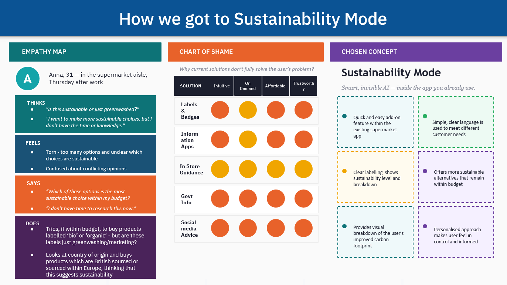

# IBM Design Challenge - AI & Sustainability

**Role:** UX Research and Ideation  
**Tools:** Figma, Sketching, Personas, Design Thinking  
**Outcome:** AI-based sustainability concept, prototype in Figma  

---

## Overview

Explored how AI can help time-poor, sustainability-aware shoppers make better choices in supermarkets. Focused on reducing cognitive burden, personalising recommendations, and nudging low-impact swaps without adding extra effort.

---

## Research & Insights

- Conducted **empathy mapping** to understand shoppers’ thoughts, feelings, actions, and frustrations
- Identified pain points: decision fatigue, unclear labelling, budget pressure
- Synthesised insights to define design opportunities and problem space

---

## Design Solution

**Chosen Concept:** Sustainability Mode - quick, add-on feature inside existing supermarket app

**Workflow**

1. Trigger - Start Shopping → open supermarket app
2. Activate - Turn on Sustainability Mode (User Control)
3. Assist - Smart, invisible AI reranks products, flags lower-impact options
4. Decide - Suggest low-friction swaps in the same price range
5. Reinforce → basket shows CO₂ impact, repeat smarter next time

🛒 Trigger → 🌿 Activate → ✨ Assist → ⇄ Decide → ↓ Reinforce → 🔁 Repeat

---

## Reflection

- Learned how to integrate AI into the UX design workflow
- Applied design thinking: empathy → ideation → prototyping → feedback
- Practised low-friction, behaviour-change design thinking
- Future improvements: mobile integration, automated preference learning
