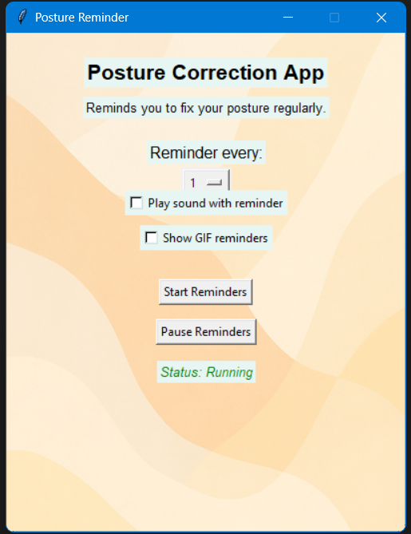

# Posture Reminder App

**Role:** UX Research, Interaction Design, Prototype Development  

**Tools:** Python, Interviews, Questionnaires, Figma (visuals to be added)  

**Outcome:** Functional prototype tested with users  

---

## Overview

Many people spend long periods at a computer or phone and forget to maintain good posture. This desktop app provides subtle, timed reminders to help users stay aware of their body position.

---

## Research

- Conducted interviews with students, remote workers, and creative professionals  
- Distributed short questionnaires to identify habits and pain points  
- Synthesised insights into key usability requirements: non-intrusive, user-controlled, low-effort, tone-aware, and accessible  

---

## Design Solution

- Lightweight Python desktop app running on Windows  
- Optional sound/gif reminder  
- Single-click confirmation of reminders  
- Adjustable intervals for user control  

*(placeholder for future Figma visuals)*

---

## Prototype Comparison

- Low-fidelity interactive prototype built in Python  
- Compared with the Wizard-of-Oz approach:

- Real-time interactivity ✅  
- Immediate feedback ✅  
- Rapid iteration possible ✅  

---

## Testing & Feedback

- Users appreciated subtle reminders over intrusive pop-ups  
- Positive reinforcement messages increased engagement  
- Some suggestions for the mobile version and accessibility improvements  

---

## Reflection

- Learned how small digital nudges can influence behaviour change  
- Future versions could include streaks, personalisation, and mobile integration  
- Plan to add Figma visuals in the next iteration  

---

## Additional Notes

### User Interview Notes
*(to be added when the project is completed)*

### Questionnaire Findings
*(to be added when the project is completed)*

### Edge Cases & Behaviour-Change Design Notes
*(to be added when the project is completed)*
